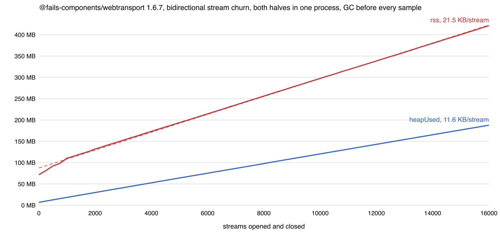
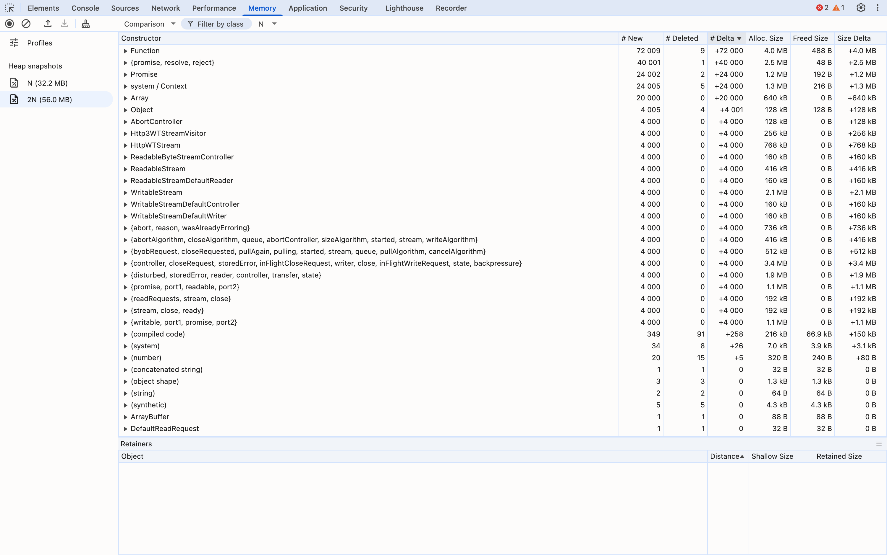
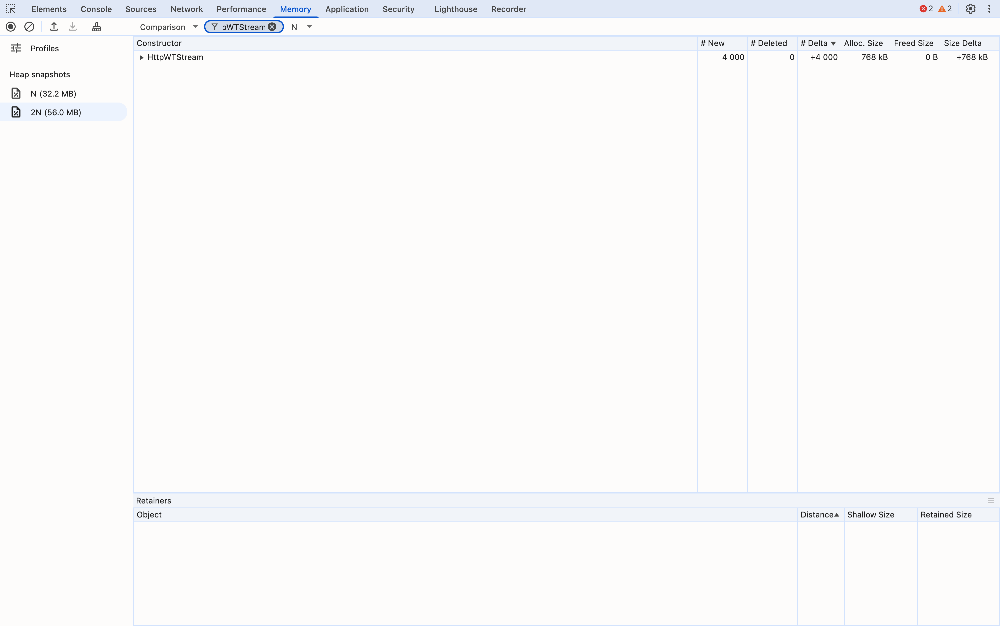
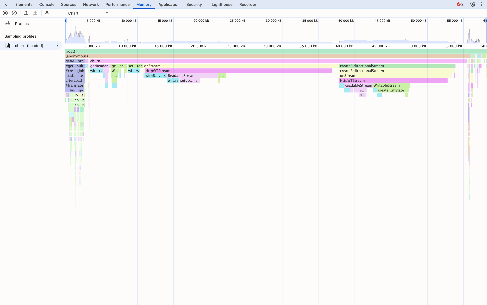
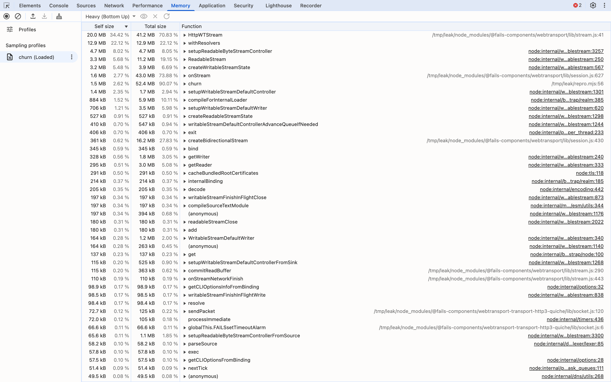
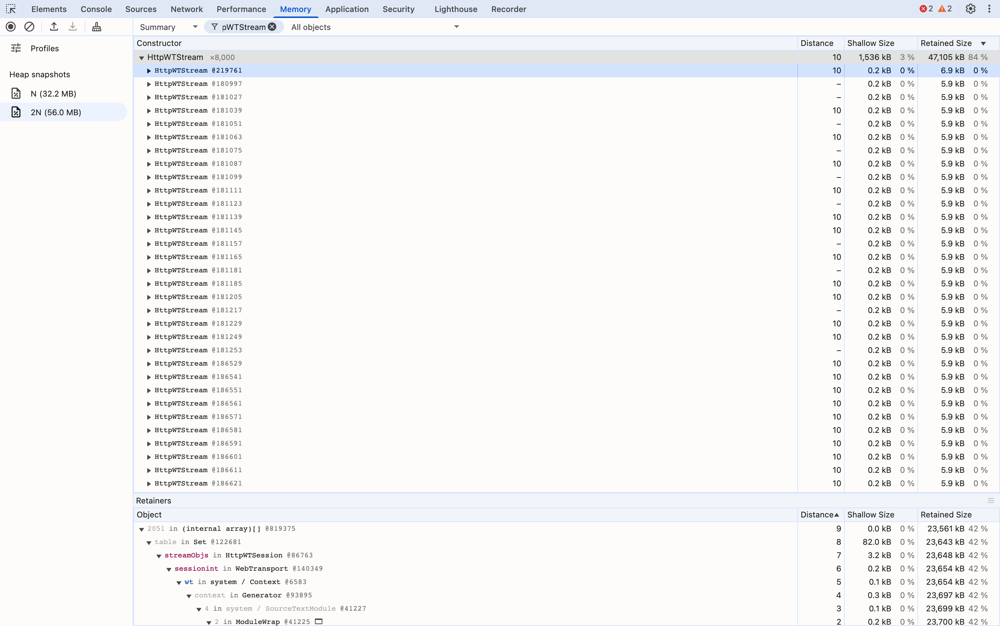
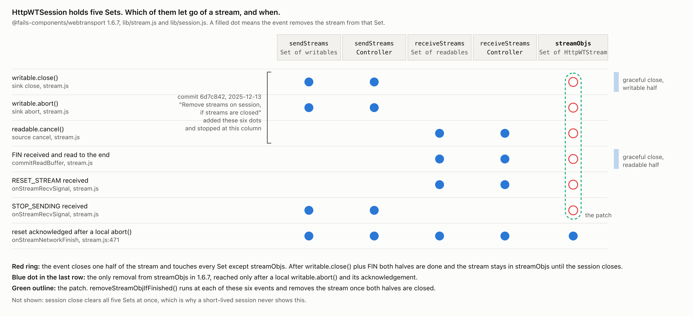
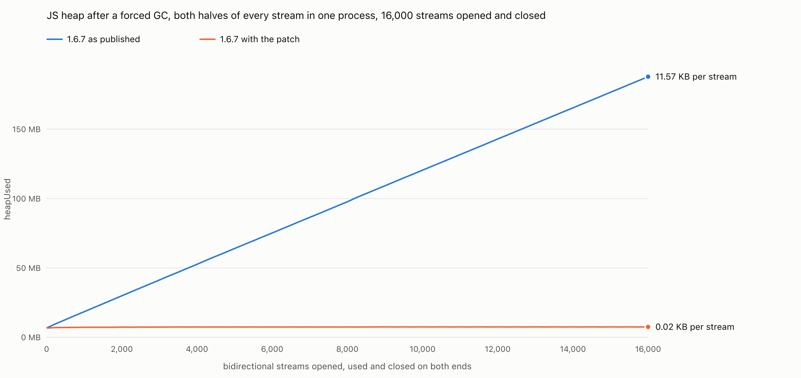

# Bidirectional streams leak in @fails-components/webtransport 1.6.7

`@fails-components/webtransport` 1.6.7 keeps every bidirectional stream reachable after both sides have closed it. The session adds each new stream to a `Set` named `streamObjs` and removes one only after a local `writable.abort()`. A stream that ends the normal way, `writable.close()` on one side and a FIN read to the end on the other, stays in the Set until the session closes.

**11.6 KB of JS heap per stream, unbounded and linear**, measured with both ends of every stream in one process, so about 5.8 KB per side. `patch.diff` fixes it and the same measurement goes flat.

Versions: `@fails-components/webtransport` 1.6.7, `@fails-components/webtransport-transport-http3-quiche` 1.6.7 (prebuilt binary), Node v22.23.2, darwin-arm64. `lib/stream.js` and `lib/session.js` on upstream `master` at 7b91cbc are byte-identical to 1.6.7.

## 1. Run the script

```
npm install
node --expose-gc repro.mjs 8000
```

`repro.mjs` starts an `Http3Server` and a `WebTransport` client in one process. The client opens a bidirectional stream, writes one byte, closes its writer, and reads the reply to the end. The server reads to the end, writes one byte, and closes. Nothing is aborted, nothing is left open. That is done N times, then N more, with three forced GCs before every measurement. `openssl` has to be on PATH for the self-signed certificate.

```
0    streams=     0  heapUsed=6.7 MB    rss=72.0 MB   external=2.8 MB
N    streams=  8000  heapUsed=97.7 MB   rss=265.7 MB  external=2.8 MB
2N   streams= 16000  heapUsed=187.9 MB  rss=432.8 MB  external=2.8 MB

per stream, N -> 2N:  heapUsed +11.54 KB   rss +21.39 KB
```

Three seconds. The second N costs the same as the first, so it is not warmup.

## 2. Watch it climb

```
node --expose-gc timeline.mjs 16000 250
```

Same churn, a forced GC and a sample every 250 streams, 65 samples, a least-squares line through them. Output is `timeline.csv` and `timeline.svg`.



| series | slope per stream | r² |
|---|---|---|
| heapUsed | 11.57 KB | 1.0000 |
| heapTotal | 12.81 KB | 0.9960 |
| rss | 21.45 KB | 0.9991 |

An r² of 1.0000 over 65 points is a line, not a trend.

## 3. Take the snapshots

```
SNAPSHOT=1 node --expose-gc repro.mjs 2000
```

That writes `N.heapsnapshot` after 2,000 streams and `2N.heapsnapshot` after 4,000, each after three forced GCs. N=2000 keeps them at 42 MB and 76 MB, which DevTools loads in about a minute.

## 4. Diff them

In Chrome DevTools: Memory tab, **Load profile**, pick `N.heapsnapshot`, then again for `2N.heapsnapshot`. Select `2N` in the sidebar, change the view dropdown from **Summary** to **Comparison**, and sort by **# Delta**.



The same diff without DevTools:

```
node --max-old-space-size=8192 heapdiff.mjs N.heapsnapshot 2N.heapsnapshot 2000
```

## 5. Name the object

Ten constructors grew by exactly 4,000 between the snapshots. N is 2,000 and every stream has two `HttpWTStream` objects in this process, one on the client session and one on the server session, so 4,000 is one per stream per side.

```
   +4000   750 KB  HttpWTStream
   +4000    94 KB  Http3WTStreamVisitor
   +4000   250 KB  ReadableStream
   +4000    94 KB  WritableStream
   +4000   156 KB  ReadableByteStreamController
   +4000   156 KB  WritableStreamDefaultController
   +4000   156 KB  ReadableStreamDefaultReader
   +4000   156 KB  WritableStreamDefaultWriter
   +4000   125 KB  AbortController
   +4000   188 KB  closure native_bind
```

Everything else that grew (property arrays, closures, contexts, promises) is owned by these. Total self size grew 11.62 KB per stream, which is the `heapUsed` slope. Click **Filter by class** and type `HttpWTStream` to see just that row.



An allocation sampling profile says where they come from:

```
node --expose-gc --heap-prof --heap-prof-interval=16384 --heap-prof-name=churn.heapprofile repro.mjs 4000
```

Load `churn.heapprofile` the same way, pick it under **Sampling profiles**, and choose **Chart**. The wide frame is the `HttpWTStream` constructor at `stream.js:41`, called from `onStream` in `session.js`.



**Heavy (Bottom Up)** puts the same constructor on top, with 72% of the sampled bytes.



## 6. Follow the retainer path

Back in the **Summary** view of `2N`, click **Filter by class**, type `HttpWTStream`, expand the row and click any instance. The **Retainers** pane below opens the shortest chain to a GC root on its own:

```
HttpWTStream @219761
  <- 2051 in (internal array)[] @819375
    <- table in Set @122681
      <- streamObjs in HttpWTSession @86763
        <- sessionint in WebTransport @140349
          <- wt in system / Context @6583     (the script's own `wt` constant)
```



That instance belongs to the client session, so DevTools reaches the root through the script's `wt` variable. Instances on the server session reach it through `jsobj in Http3WTSessionVisitor` and `(Global handles)` instead. Both chains pass through the same `streamObjs` Set, and that Set is the only strong retainer in either.

`heapdiff.mjs` prints the same path and adds two checks. It counts the entries of every Set on both sessions:

```
HttpWTSession @86763   streamObjs=4000  sendStreams=0  receiveStreams=0  sendStreamsController=0  receiveStreamsController=0
HttpWTSession @122031  streamObjs=4000  sendStreams=0  receiveStreams=0  sendStreamsController=0  receiveStreamsController=0
```

and it checks the other retainers. All 8,000 `HttpWTStream` objects are entries of a `streamObjs` Set. All 8,000 native `Http3WTStreamVisitor` wrappers hang off `(Global handles)` by weak edges only, so the C++ side has already released its reference. The Set is the only strong root.

## 7. The source

`lib/session.js:643`, in `onStream`, adds every new stream to `this.streamObjs`.

`lib/stream.js:471` is the only call to `removeStreamObj` in the package. It is inside `onStreamNetworkFinish`, case `resetStream`, and it runs only when `this.abortres` is set, which happens only in the writable's `abort` sink. A stream that ends the normal way is removed from the four other Sets and never from this one.



Upstream commit 6d7c842 (2025-12-13, "Remove streams on session, if streams are closed") added the `removeSendStream` and `removeReceiveStream` calls on close, cancel and abort. It did not touch `streamObjs`.

## 8. The fix

`patch.diff` is against upstream `master` at 7b91cbc. It adds one method to `HttpWTStream`:

```js
removeStreamObjIfFinished() {
  if (this.readable && !this.readableclosed) return
  if (this.writable && !this.writableclosed) return
  this.parentobj.removeStreamObj(this)
}
```

and calls it at each of the six events that close a half: the writable's `close` and `abort` sinks, the readable's `cancel`, the FIN in `commitReadBuffer`, and both signals in `onStreamRecvSignal`. The stream leaves the Set when the second of its two halves closes. The patch also adds a test to `bidirectional-streams.spec.js`, one to `unidirectional-streams.spec.js`, and two echo paths to the test server that serve every stream of a session rather than only the first. On 1.6.7 both tests fail with `expected 10 to equal +0`; with the patch they pass.

To apply the `lib/stream.js` hunk to the installed package:

```
git apply -p2 --directory=node_modules/@fails-components/webtransport --include='node_modules/@fails-components/webtransport/lib/stream.js' patch.diff
```

## 9. Watch it go flat

```
node --expose-gc repro.mjs 8000
```

```
0    streams=     0  heapUsed=6.7 MB  rss=71.7 MB
N    streams=  8000  heapUsed=6.4 MB  rss=140.8 MB
2N   streams= 16000  heapUsed=6.4 MB  rss=141.8 MB

per stream, N -> 2N:  heapUsed +0.00 KB   rss +0.13 KB
```



`chart.mjs` draws that from two `timeline.mjs` runs, one before applying the patch and one after: `node chart.mjs before.csv after.csv` writes `heap.svg` and `heap.html`, the latter with a hover readout and a table view. Reinstalling the published `stream.js` brings the slope back to 11.54 KB per stream; applying the patch again makes it flat. RSS goes flat too once the first few thousand streams have warmed the allocator, so the RSS beyond the JS heap in step 2 was the un-finalized native wrappers, held through the same Set.

## Loading the snapshots in Chrome DevTools

1. Open any tab and open DevTools. Click the **Memory** tab. If the tab strip is narrow it sits under **»**.
2. Click **Load profile**, either the up-arrow button at the top left of the panel or the button of that name at the bottom, and pick `N.heapsnapshot`. Repeat for `2N.heapsnapshot`. Each appears under **Heap snapshots** on the left. Wait until both show a size in MB rather than a progress note, about a minute for the pair.
3. Click **2N**. Change the dropdown at the top left of the panel from **Summary** to **Comparison**. The dropdown to its right names the baseline and should read **N**. Click the **# Delta** column header until its arrow points down. The rows reading +4 000 are the retained objects, one per stream per side.
4. Click **Filter by class** and type `HttpWTStream`. One row remains: 4 000 new, 0 deleted.
5. Switch the dropdown back to **Summary** and keep the filter. Click the triangle on the `HttpWTStream` row, then click any instance beneath it. The **Retainers** pane at the bottom opens the shortest path on its own: `(internal array)`, then `table in Set`, then `streamObjs in HttpWTSession`, then whatever owns the session. Drag the divider up if the pane is short.
6. For the allocation sites, **Load profile** again and pick `churn.heapprofile`. It appears under **Sampling profiles**. **Chart** is the flame chart. **Heavy (Bottom Up)** lists functions by self size, with `HttpWTStream stream.js:41` on top.

## License

MIT.
